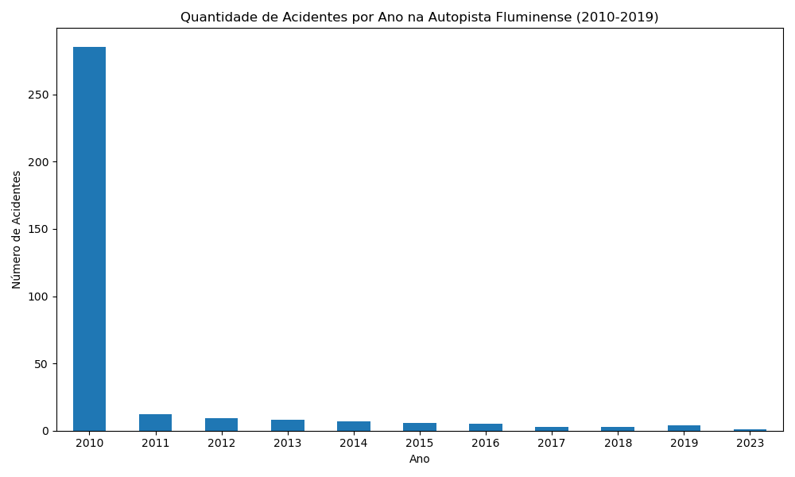

# Pipeline ETL para Análise de Acidentes na Autopista Fluminense

## Descrição
Este projeto implementa um pipeline ETL (Extract, Transform, Load) para processar dados de acidentes na rodovia Autopista Fluminense, obtidos do Portal de Dados Abertos da ANTT. Os dados abrangem o período de 2010 a 2019, contendo 52.061 registros e 23 colunas. O pipeline extrai dados de um arquivo CSV, realiza tratamentos como limpeza de valores nulos, padronização de formatos de data e horário, e remoção de duplicatas. Os dados processados são carregados em um banco PostgreSQL, e duas visualizações são geradas: uma exibindo os cinco tipos de acidentes mais frequentes e outra mostrando a quantidade de acidentes por ano.
## Tecnologias
- Python (pandas, psycopg2, matplotlib)  
- PostgreSQL  
- Git  

## Estrutura do Projeto
```text
etl-acidentes-fluminense/
├── Data/
│   └── demostrativo_acidentes_afl.csv (amostra de 1000 linhas)
├── src/
│   └── etl_pipeline.py
├── sql/
│   └── create_table.sql
├── acidentes_por_tipo.png
├── README.md
├── requirements.txt
└── .gitignore
```


## Como Executar
1. Instale Python e PostgreSQL.  
2. Crie o banco `acidentes_fluminense_db`.  
3. Execute o script SQL em `sql/create_table.sql`.  
4. Instale as dependências:  
   ```bash
   pip install -r requirements.txt
5. Atualize as configurações do banco no arquivo src/etl_pipeline.py.

6. Execute o pipeline:
    python src/etl_pipeline.py

## Resultados
- Os dados processados são armazenados na tabela acidentes_fluminense no PostgreSQL, com 23 colunas, incluindo data, tipo de acidente, número de veículos envolvidos e gravidade dos ferimentos, referentes aos anos de 2010 a 2019.
- Dois gráficos são gerados:
   - acidentes_por_tipo.png: Exibe os 5 tipos de acidentes mais frequentes.
   - acidentes_por_ano.png: Mostra a quantidade de acidentes por ano (2010-2019).

## Exemplo de Visualização




## Aprendizados
- Desenvolvimento de pipelines ETL com Python e pandas.
- Tratamento de dados reais (52.061 linhas, 23 colunas, período de 2010 a 2019), incluindo nulos, formatos de data/horário e duplicatas.
- Integração com bancos de dados relacionais (PostgreSQL).
- Geração de visualizações com matplotlib, incluindo análises por tipo de acidente e por ano.
- Versionamento de código com Git e hospedagem no GitHub.

## Fonte dos Dados
- Portal de Dados Abertos da ANTT: https://dados.antt.gov.br/dataset/ef0171a8-f0df-4817-a4ed-b4ff94d87194
## Contatos
 - LikendIn: https://www.linkedin.com/in/vanderson-hector/
 - Email: vandersonhector@outlook.com
