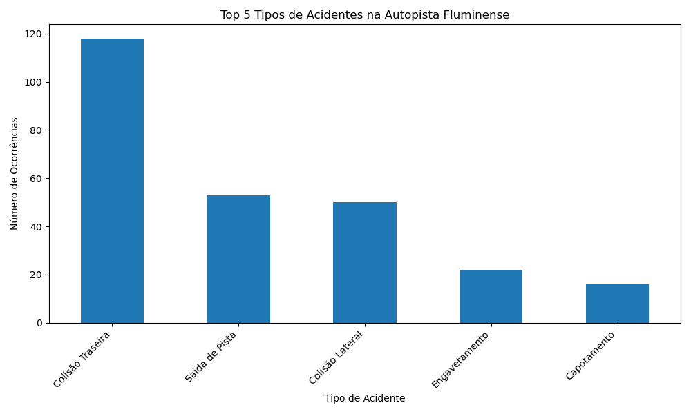

# Pipeline ETL para Análise de Acidentes na Autopista Fluminense

## Descrição
Projeto que implementa um pipeline ETL para processar dados de acidentes na rodovia Autopista Fluminense, extraídos do Portal de Dados Abertos da ANTT. O pipeline lê um arquivo CSV com 52.061 registros e 23 colunas, realiza limpeza e padronização dos dados, carrega-os em um banco PostgreSQL e gera uma visualização dos cinco tipos de acidentes mais comuns.

## Tecnologias
- Python (pandas, psycopg2, matplotlib)  
- PostgreSQL  
- Git  

## Estrutura do Projeto
```text
etl-acidentes-fluminense/
├── Data/
│   └── demostrativo_acidentes_afl.csv (amostra de 1000 linhas)
├── src/
│   └── etl_pipeline.py
├── sql/
│   └── create_table.sql
├── acidentes_por_tipo.png
├── README.md
├── requirements.txt
└── .gitignore
```


## Como Executar
1. Instale Python e PostgreSQL.  
2. Crie o banco `acidentes_fluminense_db`.  
3. Execute o script SQL em `sql/create_table.sql`.  
4. Instale as dependências:  
   ```bash
   pip install -r requirements.txt
5. Atualize as configurações do banco no arquivo src/etl_pipeline.py.

6. Execute o pipeline:
    python src/etl_pipeline.py

## Resultados
- Dados carregados na tabela acidentes_fluminense (23 colunas).
- Gráfico de barras (acidentes_por_tipo.png) com os 5 tipos de acidentes mais frequentes.

## Exemplo de Visualização




## Aprendizados
- Construção de pipelines ETL com Python.
- Tratamento de dados reais (52.061 linhas, 23 colunas).
- Integração com PostgreSQL.
- Visualização de dados com matplotlib.
- Uso de Git/GitHub para versionamento.

## Fonte dos Dados
- Portal de Dados Abertos da ANTT: https://dados.antt.gov.br/dataset/ef0171a8-f0df-4817-a4ed-b4ff94d87194
